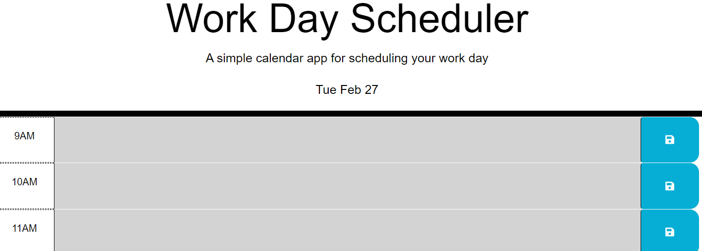

TITLE:

Work Day Scheduler

DESCRIPTION:

The Work Day Scheduler is a simple application that allows a user to save important events to a daily planner for each hour of a typical working day (9am-5pm).

ACCEPTANCE CRITERIA:

Display the current day at the top of the calendar.

Color-code each time block to represent current, past and future events (gray is past, red is current, and green is future.)

Upon clicking on the event, I can enter the event, add a text description and use the save button for that time block.

Use local storage to help save the event.

The saved event persists (i.e. is still displayed) even upon refreshing the page.

TASKS COMPLETED:

In the HTML: Created a container for the header; added remaining time blocks needed; removed past, present, future classes; added a h-100 class to text area for better formatting.
In JavaScript: Created a constant for the current date to display and dayjs variables; Created a listener for the save button; created a loop for the hour;

CREDITS:

While this job was peformed with care by yours truly,

I cannot let the assistance of my classmates, AI tool, learning assistants, TAs, and professor go unnoticed.

I look forward to your feedback. Be brutal.

LICENSE:

@oneday

LIBRARIES:

jQuery and Day,js

FEATURES:

Lots of Ctrl Z

TESTS:

My patience and my sanity

LINK:

https://katvela24.github.io/workdayscheduler/

SCREENSHOT:

